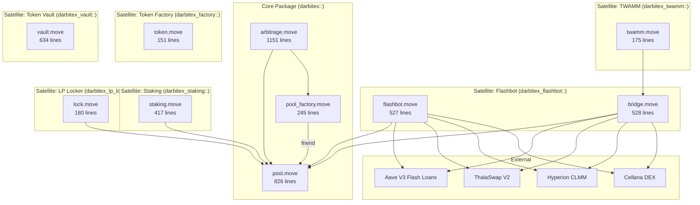
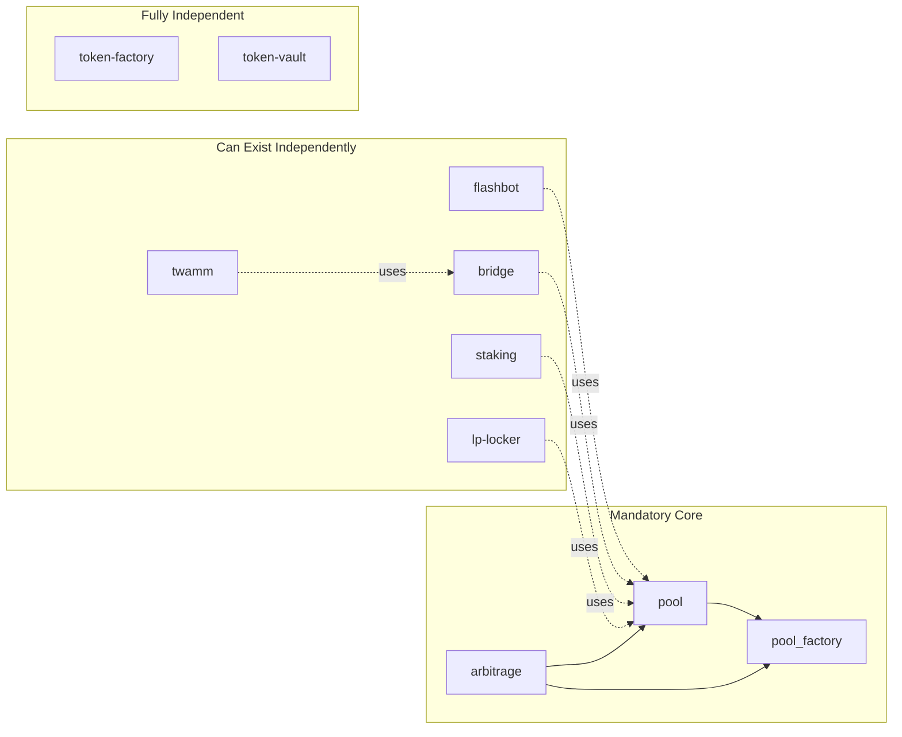

# Analisis Source Code — Darbitex Final

> **Repository**: `/home/rera/antigravity/final/`  
> **Blockchain**: Aptos (Move language)  
> **Status**: Deployed to mainnet, audited, upgrade policy `compatible`

---

## Arsitektur Keseluruhan



---

## 1. Core AMM — `pool.move` (826 lines)

### Fungsi Utama
| Fungsi | Tipe | Deskripsi |
|--------|------|-----------|
| `create_pool` | friend | Pool x*y=k dengan initial LP = √(a×b) − 1000 dead shares |
| `swap` | public | Composable swap, takes/returns `FungibleAsset`, no signer needed |
| `add_liquidity` | public | Mint LP Position NFT baru per deposit (no merging) |
| `remove_liquidity` | public | Burn position + claim proportional reserves + accumulated fees |
| `claim_lp_fees` | public | Harvest fees tanpa menyentuh principal shares |
| `flash_borrow` | public | Hot-potato flash loan, pool locked selama borrow span |
| `flash_repay` | public | Repay + fee, k-invariant check, unlock pool |
| `compute_amount_out` | public | Pure math swap simulation (u256 safe) |
| `compute_flash_fee` | public | Flash fee calc (1 bps, minimum 1 unit) |

### Konsep Kunci
- **1 bps swap fee** → 100% ke LP (via global accumulator per-share)
- **1 bps flash fee** → juga 100% ke LP
- **LP Position sebagai Object** — transferable, burned on remove
- **Reentrancy lock** — `locked: bool` flag per pool
- **No admin surface** — zero governance, constants hardcoded

### ✅ Verdict: **Solid core primitive**
Design bersih, modular, zero coupling ke modul lain (hanya `friend pool_factory`). Swap adalah composable building block.

---

## 2. Pool Factory — `pool_factory.move` (245 lines)

### Fungsi Utama
| Fungsi | Tipe | Deskripsi |
|--------|------|-----------|
| `init_factory` | entry | One-shot init, resource account + signer cap |
| `create_canonical_pool` | entry | Deterministic named-object address per sorted pair |
| `pools_containing_asset` | view | Paginated reverse index (MAX_PAGE=10) |
| `canonical_pool_address_of` | view | O(1) deterministic address derivation |

### Konsep Kunci
- **Canonical pools** — satu pool per pair (sorted BCS)
- **Asset index** — `Table<address, vector<address>>` untuk sister-pool discovery
- **Paginated reads** — bounded per-call copy cost

### ✅ Verdict: **Esensial, well-designed**
Factory ini wajib ada sebagai registry. Paginated reverse index melindungi dari gas griefing.

---

## 3. Arbitrage Module — `arbitrage.move` (1151 lines)

### Fungsi Utama
| Fungsi | Tipe | Deskripsi |
|--------|------|-----------|
| `swap_compose` | public | Smart-routed swap: DFS best path, 10% treasury cut on surplus |
| `close_triangle_compose` | public | Real-capital cycle closure (seed → cycle → profit) |
| `close_triangle_flash_compose` | public | Zero-capital flash cycle (internal flash loan) |
| `execute_path_compose` | public | Raw multi-hop execution + uniform service charge |
| `swap_entry` | entry | Wallet-facing swap wrapper |
| `quote_best_path` | view | Off-chain path discovery |
| `quote_best_cycle` | view | Off-chain cycle discovery |
| `quote_best_flash_triangle` | view | Off-chain flash topology discovery |

### Konsep Kunci
- **3-layer API**: Entry → Compose → Quote
- **DFS path search** dengan `DFS_VISIT_BUDGET = 256` (anti gas-griefing)
- **Lazy-paginated sister pool iteration** (fixes DoS vector)
- **Service charge rule**: surplus over baseline × 10% → treasury
  - Cycle: baseline = seed amount
  - Linear: baseline = canonical direct pool output (O(1) lookup)
  - No baseline = no charge (Darbitex-only route)
- **Shared DFS budget** across flash triangle candidates

### ✅ Verdict: **Ini adalah otak MEV dari Darbitex**
Module paling kompleks. DFS bounded, paginated, budget-shared. Tiga surface (path/cycle/flash) cover semua profitable opportunity.

---

## 4. Flashbot — `flashbot.move` (527 lines)

### Fungsi Utama
| Fungsi | Tipe | Deskripsi |
|--------|------|-----------|
| `run_arb` | entry | Cross-venue arb: Darbitex × Thala via Aave flash |
| `run_arb_hyperion` | entry | Cross-venue arb: Darbitex × Hyperion via Aave flash |
| `run_arb_cellana` | entry | Cross-venue arb: Darbitex × Cellana via Aave flash |

### Konsep Kunci
- Flash loan dari **Aave V3** (0 fee)
- 2-leg arb: venue A → venue B, profit split 90/10
- Caller picks leg order via `*_first` bool
- Each venue gets own entry function (different Move interfaces)

### ✅ Verdict: **Powerful cross-venue arbitrage**
Extends Darbitex reach ke seluruh Aptos DeFi ecosystem. Pure satellite — zero changes to core.

---

## 5. Bridge (Omni-Router) — `bridge.move` (528 lines)

### Fungsi Utama
| Fungsi | Tipe | Deskripsi |
|--------|------|-----------|
| `omni_swap_thala` | entry | Swap di Thala + auto backrun arb di Darbitex |
| `omni_swap_hyperion` | entry | Swap di Hyperion + auto backrun |
| `omni_swap_cellana` | entry | Swap di Cellana + auto backrun |
| `omni_swap_thala_twamm` | entry | Thala swap + **Perfect Math** arb via TWAMM oracle |
| `omni_swap_hyperion_twamm` | entry | Hyperion + Perfect Math |
| `omni_swap_cellana_twamm` | entry | Cellana + Perfect Math |
| `calculate_optimal_borrow` | internal | √(Rx × Ry × Ptwamm) − Rx optimal borrow |

### Konsep Kunci

**Mode 1: Blind Heuristic** — Borrow `amount_out / 2`, backrun, revert if loss

**Mode 2: Perfect Math** — TWAMM oracle provides fair price, bridge calculates exact optimal borrow:
```
target_in = √(k_darbitex × P_twamm)
optimal_borrow = (target_in − reserve_in) converted via TWAMM price
```

### ⚠️ Verdict: **Powerful but has design concerns**

> [!WARNING]
> **Blind Heuristic (Mode 1)**: Borrowing `amount_out / 2` tanpa mathematical justification bisa menghasilkan:
> - Over-borrowing (loss pada arb → seluruh user tx revert via `E_CANT_REPAY`)
> - Under-borrowing (missed MEV)
> 
> **Temp Object Pattern**: `object::create_object(user_addr)` di setiap call creates permanent Aptos objects yang tidak di-cleanup. Ini bisa accumulate junk on-chain.

**Cocok digabung?** Ya, tapi Mode 1 heuristic perlu refinement. Mode 2 (Perfect Math) sangat solid.

---

## 6. TWAMM — `twamm.move` (175 lines)

### Fungsi Utama
| Fungsi | Tipe | Deskripsi |
|--------|------|-----------|
| `create_order` | entry | Deposit token, split over duration_seconds |
| `execute_virtual_order` | entry | Keeper executes time-proportional chunk |
| `init_ema_oracle` | public | Bootstrap EMA oracle state |

### Konsep Kunci
- **Time-Weighted AMM**: Large orders split & executed over time
- **Self-Contained EMA Oracle**: `new_ema = (old × 9 + spot × 1) / 10`
- **Synergy**: TWAMM → Bridge (Perfect Math) → MEV profit → 90% back to order owner

### ⚠️ Verdict: **Innovative but early-stage**

> [!IMPORTANT]  
> - EMA oracle di-seed manual (`init_ema_oracle`) — bisa di-manipulate pada start
> - `min_amount_out = 0` di `execute_virtual_order` — no slippage protection untuk order owner
> - Keeper-based (bukan truly autonomous on-chain)
> - Tidak ada cancellation mechanism untuk active orders

**Cocok digabung?** Ya, ini value-add unik. TWAMM + Bridge Perfect Math = autonomous MEV capture system.

---

## 7. LP Staking — `staking.move` (417 lines)

### Fungsi Utama
| Fungsi | Tipe | Deskripsi |
|--------|------|-----------|
| `create_lp_reward_pool` | entry | Permissionless reward pool creation (1 APT fee) |
| `stake_lp` | entry | Transfer LP Position ke stake wrapper |
| `claim_rewards` | entry | Harvest staking rewards |
| `claim_lp_fees` | entry | Proxy claim LP fees while staked |
| `unstake_lp` | entry | Return LP Position + final rewards |

### Konsep Kunci
- **Accumulator-based rewards** (MasterChef V2 pattern)
- **Emission rate** = linear ramp up to `max_rate` at `stake_target`
- **Permissionless** — anyone can create reward pools
- LP fees remain claimable during staking

### ✅ Verdict: **Standard, solid**
Well-implemented MasterChef V2. Permissionless design good for ecosystem.

---

## 8. LP Locker — `lock.move` (180 lines)

### Fungsi Utama
| Fungsi | Tipe | Deskripsi |
|--------|------|-----------|
| `lock_position` | entry | Time-lock LP Position |
| `claim_fees` | entry | Harvest fees while locked |
| `redeem` | entry | Unlock after time expires |

### ✅ Verdict: **Simple, clean, essential**
Standard LP locking untuk project trust. Fees tetap bisa di-claim selama lock.

---

## 9. Token Factory — `token.move` (151 lines)

### Fungsi Utama
| Fungsi | Tipe | Deskripsi |
|--------|------|-----------|
| `create_token` | entry | Mint 1B supply FA, APT fee by symbol length |
| `burn` | entry | Burn tokens via stored BurnRef |

### Konsep Kunci
- Fixed supply: 1B × 10^8 (8 decimals)
- `MintRef` dropped after creation → no future minting
- Fee: 1000 APT (1 char) → 0.1 APT (5+ chars)

### ✅ Verdict: **Revenue generator, standard**
Simple token launchpad. Fee structure encourages short-symbol premium.

---

## 10. Token Vault — `vault.move` (634 lines)

### 3 Mode
| Mode | Deskripsi |
|------|-----------|
| **Lock** | Time-locked token vault |
| **Vest** | Linear vesting schedule |
| **Stake** | Token staking reward pool (MasterChef V2) |

### ✅ Verdict: **Comprehensive tokenomics toolkit**
Covers lock/vest/stake for any Fungible Asset. 1 APT creation fee per operation.

---

## Dependency Graph (Kelayakan Digabung)



---

## Rekomendasi: Apakah Baik Digabung?

### ✅ Yang HARUS digabung (saling tergantung)

| Module | Alasan |
|--------|--------|
| `pool.move` | Core AMM — fondasi segalanya |
| `pool_factory.move` | Registry — diperlukan oleh pool + arbitrage |
| `arbitrage.move` | Otak MEV — differentiator utama Darbitex |

> [!IMPORTANT]
> Ketiga module ini **sudah** dalam satu package (`darbitex::`) dan **harus** tetap bersama. Mereka adalah identitas Darbitex.

### ✅ Yang SEBAIKNYA digabung (high synergy)

| Module | Alasan | Catatan |
|--------|--------|---------|
| `flashbot.move` | Extends arb ke seluruh Aptos | Tetap satellite, referensi core via address |
| `bridge.move` | Omni-router + MEV capture | **Kunci revenue** — setiap swap di venue lain = backrun opportunity |
| `twamm.move` | Autonomous MEV dispatch | Sinergi unik TWAMM→Bridge→Perfect Math |
| `staking.move` | LP retention | Incentivize liquidity depth |

### 🟡 Yang BISA digabung (nice-to-have, low coupling)

| Module | Alasan | Catatan |
|--------|--------|---------|
| `lp-locker` | Trust signal untuk LP | Independent satellite, no core dependency |
| `token-factory` | Revenue + ecosystem | Fully standalone, hanya share treasury address |
| `token-vault` | Tokenomics toolkit | Fully standalone |

### Arsitektur Ideal

```
darbitex (core package, immutable eventually)
├── pool.move
├── pool_factory.move
└── arbitrage.move

darbitex_flashbot (satellite, upgradeable)
├── flashbot.move          ← cross-venue arb
└── bridge.move            ← omni-router + MEV

darbitex_twamm (satellite, upgradeable)
└── twamm.move             ← autonomous dispatch

darbitex_staking (satellite, upgradeable)
└── staking.move           ← LP rewards

darbitex_lp_locker (satellite, frozen)
└── lock.move              ← LP time-lock

darbitex_factory (satellite, frozen)
└── token.move             ← token creation

darbitex_vault (satellite, frozen)
└── vault.move             ← lock/vest/stake
```

> [!TIP]
> **Ini sudah arsitektur yang benar.** Core immutable, satellites upgradeable. Setiap satellite hanya depends on core's public API. Tidak ada reverse dependency. Ini adalah pattern yang sangat baik.

---

## Kesimpulan

**Ya, semua module ini layak digabung di bawah brand Darbitex** — dan memang sudah terstruktur dengan benar:

1. **Core (pool + factory + arbitrage)** = satu package, satu deploy, satu identity
2. **Revenue satellites (flashbot + bridge + twamm)** = the money makers, satellite packages
3. **Ecosystem tools (staking + locker + factory + vault)** = user retention & tokenomics

**Kekuatan utama**: Tidak ada DEX lain di Aptos yang punya **autonomous MEV capture** seperti ini. Cycle arbitrage + cross-venue flash arb + TWAMM oracle integration = unique competitive advantage.

**Area perlu perhatian**:
- Bridge Mode 1 heuristic (`amount_out / 2`) → perlu mathematical refinement
- TWAMM oracle bootstrap → perlu manipulation resistance
- Temp object cleanup di bridge → potential on-chain bloat
